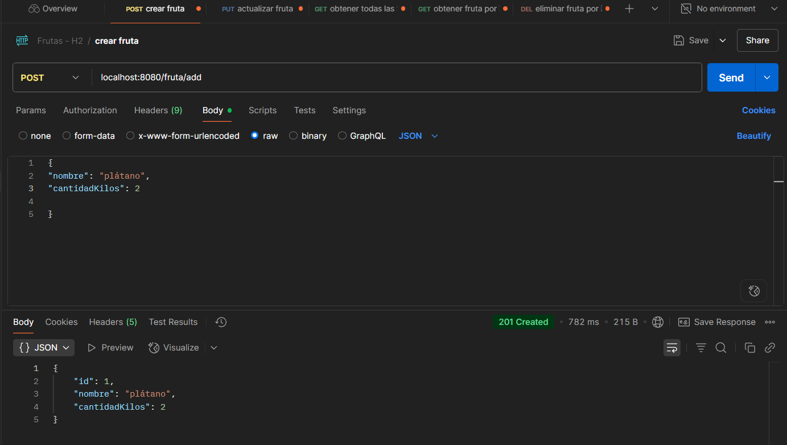
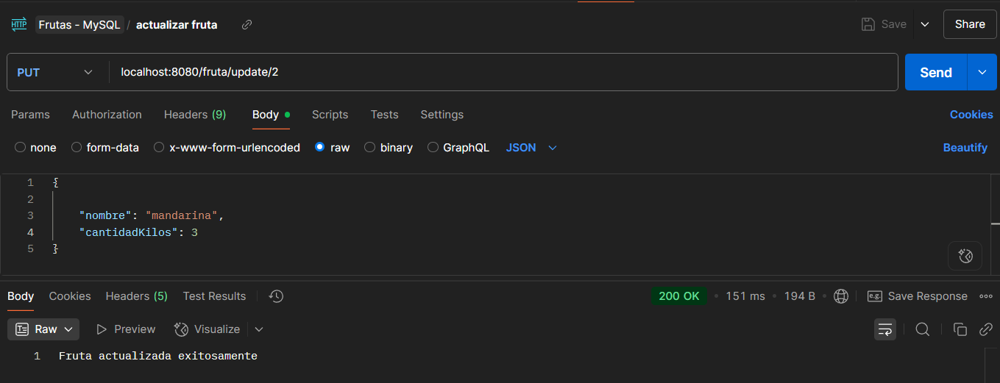
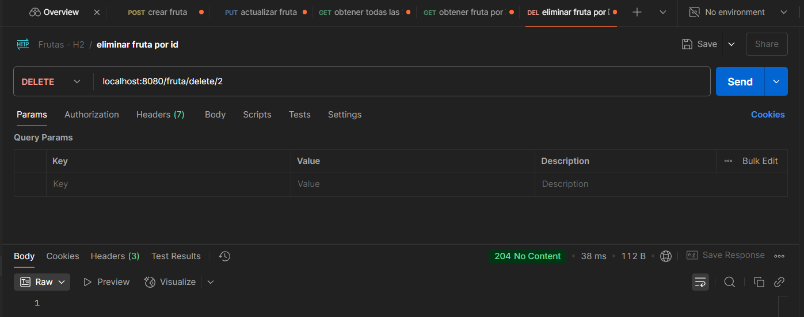
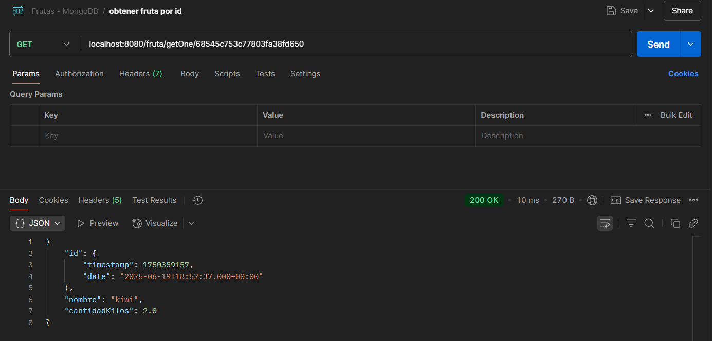
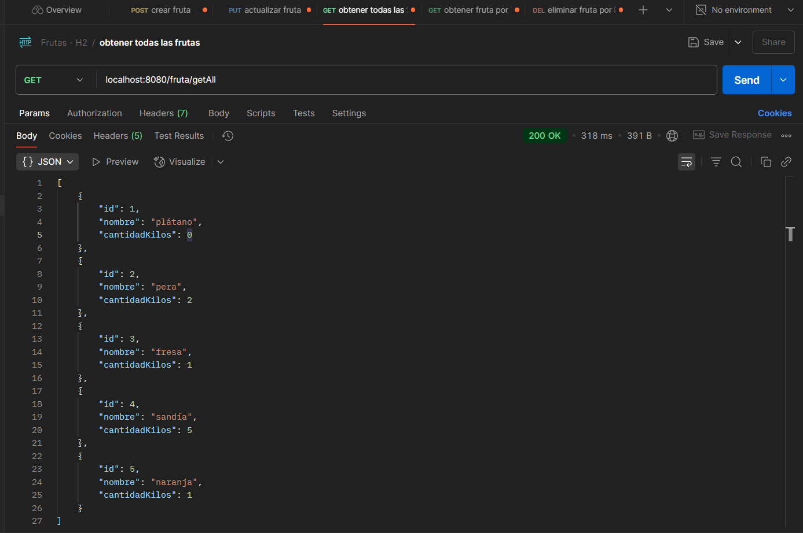
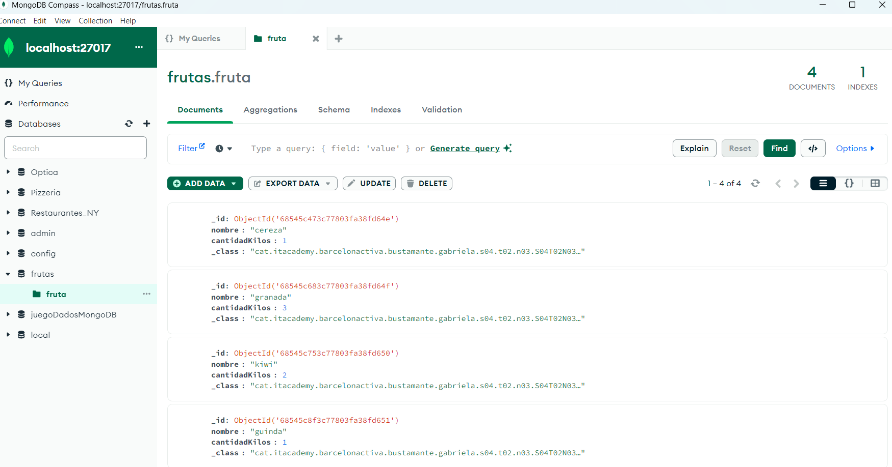

# 🚀 Sprint 4 · Tasca 2 · Nivel 3: API REST con Spring Boot - CRUD con MongoDB

---

## 📄 Descripción

En esta tarea se desarrolla una API REST usando **Spring Boot** que implementa operaciones **CRUD** sobre una entidad llamada `Fruta`. Esta entidad se persiste en una base de datos **MongoDB** y el proyecto sigue el patrón **MVC**.

Durante la implementación se han puesto en práctica conceptos clave como:

- Uso correcto de los **verbos HTTP**.
- Gestión adecuada de **códigos de estado HTTP (Status Codes)**.
- Configuración y prueba de **endpoints** con Postman.
- Manejo centralizado de errores usando un **GlobalExceptionHandler**.
- Uso de **ResponseEntity** para respuestas más controladas.


---

## 🎯 Objetivos

- HTTP Verbos
- HTTP Headers
- HTTP Status Codes
- CRUD con Spring Boot
- MongoDB

---

## 💻 Tecnologías utilizadas

- **Java 17**
- **Spring Boot** (última versión estable)
- **Maven** (gestor de dependencias)
- **IntelliJ IDEA**
- **Postman** (para pruebas HTTP)
- **MongoDB Compass** (cliente gráfico para gestionar bases de datos MongoDB)
- **MongoDB Community Server** (servidor de base de datos local)

---

## 📋 Requisitos

- Java JDK 17 instalado
- Maven instalado y configurado en el sistema
- IntelliJ IDEA o Eclipse
- Postman o cualquier cliente HTTP para probar la API
- MongoDB Community Server instalado y ejecutándose localmente
- MongoDB Compass (opcional, para visualizar colecciones y documentos)

---

## 📁 Estructura del proyecto

```bash
S04T02N03BustamanteGabriela/
├── .idea/
├── .mvn/
├── screenshots/
│   ├── add_fruta.png
│   ├── delete_fruta.png
│   ├── get_all_frutas.png
│   ├── get_one_fruta.png
│   ├── mongodb_frutas_collection.png
│   └── update_fruta.png
├── src/
│   ├── main/
│   │   ├── java/
│   │   │   └── cat/itacademy/barcelonactiva/bustamante/gabriela/s04/t02/n03/S04T02N03BustamanteGabriela/
│   │   │       ├── controllers/
│   │   │       │   └── FrutaController.java
│   │   │       ├── exception/
│   │   │       │   ├── FrutaNotFoundException.java
│   │   │       │   └── GlobalExceptionHandler.java
│   │   │       ├── model/
│   │   │       │   └── domain/
│   │   │       │       └── Fruta.java
│   │   │       ├── repository/
│   │   │       │   └── FrutaRepositorio.java
│   │   │       ├── services/
│   │   │       │   ├── ServicioFruta.java
│   │   │       │   └── ServicioFrutaImpl.java
│   │   │       └── S04T02N03BustamanteGabrielaApplication.java
│   │   └── resources/
│   │       └── application.properties
│   └── test/
│       └── java/
│           └── cat/itacademy/barcelonactiva/bustamante/gabriela/s04/t02/n03/S04T02N03BustamanteGabriela/
│               └── S04T02N03BustamanteGabrielaApplicationTests.java
├── .gitignore
├── HELP.md
├── mvnw
├── mvnw.cmd
├── pom.xml
└── README.md
```

---

## 🚀 Funcionalidades

- ➕ **POST** `/fruta/add`  
  Crea una nueva fruta.

- ✏️ **PUT** `/fruta/update/{id}`  
  Actualiza una fruta existente.

- ❌ **DELETE** `/fruta/delete/{id}`  
  Elimina una fruta por su ID.

- 🔍 **GET** `/fruta/getOne/{id}`  
  Obtiene una fruta por ID.

- 📋 **GET** `/fruta/getAll`  
  Lista todas las frutas.


---

## 🧰 Comandos Maven importantes

Desde la terminal, en el directorio del proyecto, se pueden ejecutar:

- `mvn compile` — Compila el proyecto
- `mvn package` — Empaqueta el proyecto
- `mvn clean` — Limpia los archivos compilados
- `mvn spring-boot:run` — Ejecuta la aplicación Spring Boot

---
## 🛠️ Instalación

1. Clona el repositorio:  
   `git clone https://github.com/GabyB73/Sprint4Tasca2Nivel3.git`
2. Abre el proyecto en IntelliJ o Eclipse.
3. Asegúrate de que el archivo `pom.xml` está presente y actualizado.
4. Verifica que tengas una instancia de MongoDB ejecutándose en `localhost:27017`.
5. La aplicación está configurada para usar la base de datos llamada `frutas`. En `application.properties`:
```bash
    spring.data.mongodb.database=frutas
    spring.data.mongodb.port=27017
```
6. Ejecuta la aplicación con:
```bash
mvn spring-boot:run
```
7.  Puedes visualizar los datos usando **MongoDB Compass** conectándote a:
```
mongodb://localhost:27017
```

---

## ▶️ Ejecución

Una vez ejecutado, puedes probar los siguientes endpoints en Postman:
```bash
POST    http://localhost:8080/fruta/add
PUT     http://localhost:8080/fruta/update/{id}
DELETE  http://localhost:8080/fruta/delete/{id}
GET     http://localhost:8080/fruta/getOne/{id}
GET     http://localhost:8080/fruta/getAll
```

📌 Asegúrate de enviar los datos como JSON en las peticiones POST y PUT.
 
---
### 📸 Capturas de pantalla

#### ➕ Añadir fruta


#### ✏️ Actualizar fruta


#### ❌ Eliminar fruta


#### 🔍 Obtener una fruta


#### 📋 Obtener todas las frutas


#### 🧪 MongoDB Compass

---
## 🔗 Recursos utilizados

1- https://www.geeksforgeeks.org/spring-boot-crud-operations-using-mongodb/

2- https://www.baeldung.com/spring-response-entity

3- https://www.youtube.com/watch?v=k5PeywcbVYc

---

## 🤝 Contribuciones

Este es un proyecto de práctica del bootcamp IT Academy.    
Las contribuciones no son necesarias, pero puedes hacer un fork o dejar comentarios si lo deseas.
  
---

## 👩‍💻 Autora

Desarrollado por **[Gabriela Bustamante](https://github.com/GabyB73)**  
Bootcamp de Desarrollo Java - IT Academy  
